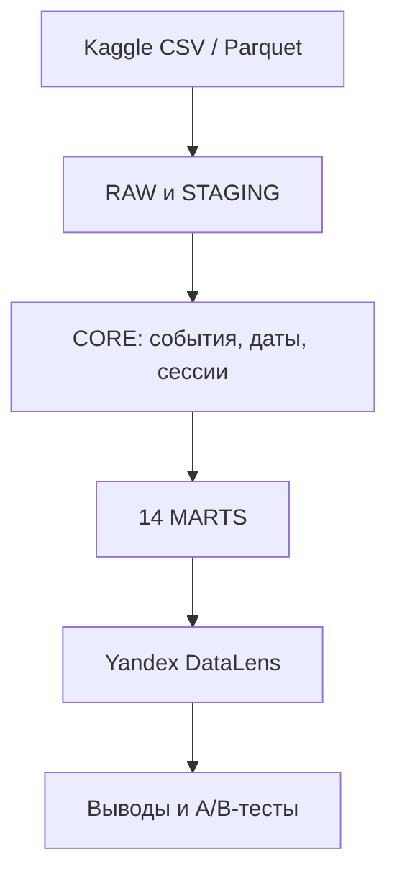

# Expedia Hotel Recommendations — Product Analytics

Продуктово-аналитический проект на данных Expedia: от очистки 37,7 млн строк
сырых логов и восстановления пользовательских сессий до 14 аналитических
витрин, дашборда и проверяемых продуктовых гипотез.

## Дашборд

**[Открыть публичный дашборд в Yandex DataLens](https://datalens.yandex/wr90wsuootm2f)**

В дашборде собраны ключевые продуктовые показатели, динамика во времени,
каналы и платформы, поведение пользователей, география поездок, календарные
паттерны и качество данных.

## Цель проекта

Пройти полный цикл работы продуктового аналитика на большом сыром датасете:

- исследовать структуру и качество исходных данных;
- построить воспроизводимый pipeline `RAW → STAGING → CORE → MARTS`;
- определить корректные продуктовые метрики;
- собрать витрины для BI и опубликовать аналитический дашборд;
- сформулировать выводы, точки роста и дизайн A/B-тестов.

## Данные

Источник: [Kaggle — Expedia Hotel Recommendations](https://www.kaggle.com/competitions/expedia-hotel-recommendations/overview).

Основной `train` содержит 37 670 293 строки и 24 исходных поля за 2013–2014
годы. Сырые файлы не включены в репозиторий из-за размера и условий
распространения. В репозитории находятся только скрипты обработки и готовые
агрегированные витрины, использованные в DataLens.

## Архитектура



Сессии восстановлены аналитически по правилу `gap_30m_v1`: новая сессия
начинается, если разрыв между соседними событиями одного пользователя строго
больше 30 минут. Поле `cnt` влияет на взвешенные метрики, но не на границы
сессий.

## Ключевые результаты

- 1 198 786 пользователей и 37 669 324 валидных аналитических event rows;
- 3 000 689 booking rows, общая row-конверсия в бронирование — **7,97%**;
- 12 242 331 восстановленная сессия, доля сессий с бронированием — **21,74%**;
- mobile даёт 13,49% event rows, но 9,92% бронирований; row-конверсия mobile
  составляет 5,86% против 8,29% на desktop;
- среди пользователей, совершивших хотя бы одно бронирование, 61,22%
  бронировали повторно в пределах наблюдаемого окна;
- в 2014 году объём event rows вырос на 136,73% к 2013 году, а row-конверсия
  снизилась с 9,16% до 7,46%; это диагностический сигнал, а не доказательство
  причинно-следственной связи.

Полный разбор: [аналитическое саммари](docs/analytical_summary.md).

## 14 витрин

| Витрина | Grain | Строк |
|---|---|---:|
| `mart_product_daily` | день события | 724 |
| `mart_session_daily` | день начала сессии | 724 |
| `mart_travel_calendar_daily` | календарный день | 6 908 |
| `mart_channel_platform` | месяц × канал × платформа × mobile | 11 720 |
| `mart_destination_performance` | месяц × destination × hotel market | 502 728 |
| `mart_user_360` | пользователь | 1 198 786 |
| `mart_origin_destination` | месяц × страна пользователя × страна отеля | 151 998 |
| `mart_trip_profile` | месяц × lead-time × stay × состав группы | 2 399 |
| `mart_package_profile` | профиль поездки × package × канал × mobile | 72 280 |
| `mart_retention_cohort` | когорта первого бронирования × месяц жизни | 300 |
| `mart_booking_frequency` | укрупнённый диапазон числа бронирований | 5 |
| `mart_booking_frequency_exact` | точное число бронирований | 101 |
| `mart_data_quality_daily` | день события | 724 |
| `mart_distance_quality` | уровень импутации × min support | 49 |

Подробные grain, ключи, поля и связи описаны в
[структуре витрин](docs/marts_structure.md).

## Состав репозитория

| Путь | Содержимое |
|---|---|
| `data/marts/` | 14 CSV-витрин из DataLens |
| `scripts/build_core.py` | очистка, дедупликация, CORE и импутация distance |
| `scripts/build_analytics.py` | восстановление сессий и сборка 14 MARTS |
| `scripts/export_marts_csv.py` | экспорт Parquet-витрин в CSV |
| `scripts/validate_marts.py` | проверка состава, схем и числа строк |
| `notebooks/EDA.ipynb` | исследовательский анализ |
| `docs/marts_structure.md` | структура и назначение витрин |
| `docs/analytical_summary.md` | ключевые выводы и ограничения |
| `docs/ab_test_hypotheses.md` | приоритизированные A/B-гипотезы |
| `presentation/` | место для презентации, которая будет добавлена позже |

## Локальная пересборка

Требования: Python 3.11+, DuckDB и pandas.

```bash
python -m venv .venv
source .venv/bin/activate
pip install -r requirements.txt
```

Поместите скачанные и преобразованные в Parquet исходники в:

```text
data/parquet/train_full.parquet
data/parquet/test.parquet
data/parquet/destinations.parquet
```

Затем выполните:

```bash
python scripts/build_core.py
python scripts/build_analytics.py
python scripts/export_marts_csv.py
python scripts/validate_marts.py
```

По умолчанию DuckDB использует один thread и лимит памяти 1 GB с временным
spill-to-disk. Настройки можно переопределить переменными
`EXPEDIA_DUCKDB_THREADS` и `EXPEDIA_DUCKDB_MEMORY_LIMIT`.

## Важные определения

- `row_events = COUNT(*)` — число строк агрегированного source-log;
- `weighted_events = SUM(cnt)` — объём с учётом multiplicity;
- `booking_row_rate = bookings / row_events`;
- `booking_weighted_event_rate` использует `cnt` и не равна row-конверсии;
- `booking_value_proxy` — относительный score (`1` для hotel-only и `2` для
  package booking), **не выручка и не денежная метрика**;
- retention показывает повторные бронирования внутри наблюдаемого окна, а не
  lifetime retention.

## Git LFS

`mart_user_360.csv` занимает около 177 MB и хранится через Git LFS. Перед
клонированием данных установите Git LFS и выполните:

```bash
git lfs install
git lfs pull
```
