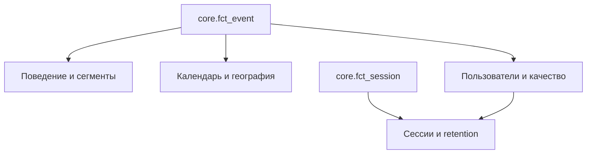

# Структура аналитических витрин

Документ описывает 14 CSV-витрин, которые находятся в `data/marts/` и
используются в Yandex DataLens.

## Общие правила метрик

| Поле | Определение |
|---|---|
| `row_events` / `events` | количество агрегированных source rows |
| `weighted_events` | сумма `cnt` |
| `bookings` | количество rows с `is_booking = 1` |
| `bookers` | уникальные пользователи с booking |
| `booking_row_rate` | `bookings / row_events` |
| `booking_weighted_event_rate` | weighted bookings / `weighted_events` |
| `booking_value_proxy_total` | сумма относительного value score, не деньги |
| `active_users` / `users` | уникальные пользователи внутри grain строки |

Доли хранятся от `0` до `1`. Для отображения в процентах форматирование
выполняется в BI. Большинство месячных полей представлены датой первого дня
месяца. Исключения в финальных CSV: `mart_package_profile.year_month` имеет
формат `YYYY/MM/01`, а `mart_travel_calendar_daily.year_month` — `YYYY-MM`;
их нужно явно типизировать при подключении.

## Карта зависимостей

## Сводный каталог

| Витрина | Grain / уникальная комбинация | Источник | Строк |
|---|---|---|---:|
| `mart_product_daily` | `date_key` | события | 724 |
| `mart_session_daily` | `date_key` начала сессии | сессии | 724 |
| `mart_travel_calendar_daily` | `date_key` календаря | события + check-in/out | 6 908 |
| `mart_channel_platform` | `year_month, channel, platform_id, is_mobile` | события | 11 720 |
| `mart_destination_performance` | `year_month, destination_id, hotel_market_id` | события | 502 728 |
| `mart_user_360` | `user_id` | события + сессии | 1 198 786 |
| `mart_origin_destination` | `year_month, user_country, hotel_country` | события | 151 998 |
| `mart_trip_profile` | месяц × lead bucket × stay bucket × party | события + сессии | 2 399 |
| `mart_package_profile` | trip profile × package × channel × mobile | события | 72 280 |
| `mart_retention_cohort` | `cohort_month, months_since_first_booking` | бронирования | 300 |
| `mart_booking_frequency` | booking bucket | `mart_user_360` | 5 |
| `mart_booking_frequency_exact` | точное `bookings` | `mart_user_360` | 101 |
| `mart_data_quality_daily` | `date_key` | quality flags | 724 |
| `mart_distance_quality` | `imputation_level, min_support` | holdout validation | 49 |

## 1. `mart_product_daily`

Основная дневная продуктовая витрина.

- ключ: `date_key`;
- объём: `active_users`, `row_events`, `weighted_events`;
- бронирования: `bookings`, `bookers`, `booking_row_rate`,
  `booking_weighted_event_rate`, `booker_rate`;
- value proxy: `booking_value_proxy_total`,
  `booking_value_proxy_per_active_user`,
  `avg_booking_value_proxy_per_booking`;
- mix: `mobile_row_share`, `mobile_booking_share`, `package_booking_share`;
- поездка и качество: `avg_valid_lead_days`, `avg_valid_stay_nights`,
  `avg_distance_filled`, `distance_imputed_share`.

Используется для KPI-карточек и временной динамики продукта.

## 2. `mart_session_daily`

Дневные показатели восстановленных сессий.

- ключ: `date_key` начала сессии;
- поля объёма: `active_users`, `sessions`, `booking_sessions`;
- эффективность: `session_booking_rate`, `sessions_per_user`,
  `booking_value_proxy_per_session`;
- поведение: `avg_rows_per_session`, `avg_weighted_events_per_session`,
  `median_session_duration_seconds`, `avg_time_to_first_booking_seconds`,
  `multi_destination_session_share`;
- дополнительная мера: `booking_value_proxy_total`.

## 3. `mart_travel_calendar_daily`

Объединяет три роли даты: дата события, check-in и check-out.

- ключи календаря: `date_key`, `full_date`, `year`, `month`, `year_month`;
- активность: `events_on_date`, `weighted_events_on_date`,
  `bookings_made_on_date`;
- поездки: `checkins_on_date`, `checkouts_on_date`, `package_checkins`,
  `booking_value_proxy_for_checkins`;
- профиль: `avg_stay_nights_for_checkins`, `avg_lead_days_for_checkins`.

Нули между датами сохранены, поэтому витрина подходит для непрерывного
календарного графика. Физический диапазон финального CSV —
2012-02-15–2031-01-13; осмысленная train-активность сосредоточена в
2013–2015 годах, поэтому пользовательский период обязателен.

## 4. `mart_channel_platform`

Сравнение каналов и платформ во времени.

- grain: `year_month, channel, platform_id, is_mobile`;
- объём: `active_users`, `row_events`, `weighted_events`, `bookings`;
- эффективность: `booking_row_rate`, `booking_weighted_event_rate`,
  `booking_value_proxy_per_active_user`;
- состав: `package_booking_share`;
- профиль поездки: `avg_valid_lead_days`, `avg_valid_stay_nights`;
- итоговый score: `booking_value_proxy_total`.

`active_users` нельзя суммировать между каналами без дедупликации.

## 5. `mart_destination_performance`

Производительность обезличенных destinations и hotel markets.

- grain: `year_month, destination_id, hotel_market_id`;
- объём: `active_users`, `row_events`, `weighted_events`, `bookings`, `bookers`;
- конверсии: `booking_row_rate`, `booking_weighted_event_rate`;
- mix и профиль: `package_booking_share`, `avg_distance_filled`,
  `avg_valid_lead_days`, `avg_valid_stay_nights`;
- value proxy: `booking_value_proxy_total`;
- флаги надёжности: `meets_min_volume_flag` (`row_events >= 100`) и
  `meets_booking_min_volume_flag` (`bookings >= 10`).

Флаги объёма нужно применять перед сравнением конверсии малых направлений.

## 6. `mart_user_360`

Одна строка на пользователя за всё наблюдаемое окно.

- ключ: `user_id`;
- жизненный цикл: `first_seen_date`, `last_seen_date`, `active_days`,
  `active_months`, `observation_end_date`;
- активность: `row_events`, `weighted_events`, `sessions`,
  `session_frequency`;
- бронирования: `bookings`, `first_booking_date`, `last_booking_date`,
  `booking_sessions`, `days_since_last_booking`, `booking_frequency`;
- value/package/mobile: `booking_value_proxy_total`,
  `avg_booking_value_proxy`, `package_bookings`, `package_booking_share`,
  `mobile_event_share`;
- разнообразие и поездки: `distinct_destinations`,
  `distinct_hotel_markets`, `avg_valid_lead_days`, `avg_valid_stay_nights`,
  `avg_distance_filled`.

Витрина используется для частоты бронирований, repeat booking и пользовательских
сегментов.

## 7. `mart_origin_destination`

Потоки между страной пользователя и страной отеля.

- grain: `year_month, user_country, hotel_country`;
- объём: `active_users`, `row_events`, `weighted_events`, `bookings`;
- эффективность: `booking_row_rate`, `booking_value_proxy_total`;
- профиль: `avg_distance_filled`, `package_booking_share`,
  `avg_valid_stay_nights`, `avg_valid_lead_days`.

## 8. `mart_trip_profile`

Поведение по параметрам будущей поездки.

- grain: `year_month, lead_time_bucket, stay_length_bucket, party_segment`;
- объём: `users`, `events`, `weighted_events`, `bookings`, `sessions`,
  `booking_sessions`;
- эффективность: `booking_row_rate`, `booking_weighted_event_rate`,
  `session_booking_rate`;
- mix: `package_share`, `mobile_share`;
- score: `booking_value_proxy_total`.

Бакеты lead time: `same_next_day`, `2_7`, `8_30`, `31_90`, `91_plus`.
Бакеты stay: `1`, `2_3`, `4_7`, `8_14`, `15_plus`. Сегменты группы:
`solo`, `couple`, `family_with_children`, `group`.

## 9. `mart_package_profile`

Детализация профиля поездки по пакетному сценарию, каналу и mobile.

- grain: `year_month, is_package, lead_time_bucket, stay_length_bucket,
  party_segment, channel, is_mobile`;
- объём: `users`, `events`, `weighted_events`, `bookings`,
  `weighted_bookings`;
- эффективность: `booking_row_rate`, `booking_weighted_event_rate`;
- score: `booking_value_proxy_total`.

Это основная витрина для гипотез о package funnel и приоритизации сегмента
mobile package channel 9.

## 10. `mart_retention_cohort`

Когортная витрина повторных бронирований.

- ключ: `cohort_month, months_since_first_booking`;
- размер: `cohort_users`;
- возврат: `returned_bookers`, `booking_retention_rate`;
- активность: `bookings`, `booking_value_proxy_total`.

`month 0` равен 100% по определению. Дальнейшие значения — доля пользователей
когорты, сделавших booking именно в соответствующем месяце жизни. Это не
накопительный survival retention.

## 11. `mart_booking_frequency`

Укрупнённое распределение пользователей по числу бронирований.

- ключ: `booking_count_bucket` (`0`, `1`, `2`, `3`, `4_plus`);
- сортировка: `booking_count_bucket_order`;
- размер: `users`, `user_share`;
- профиль: `avg_sessions`, `avg_active_months`,
  `avg_booking_value_proxy`, `avg_package_booking_share`.

## 12. `mart_booking_frequency_exact`

Точное распределение от 0 до 100 booking rows на пользователя.

- ключ: `bookings`;
- показатели: `users`, `user_share`.

В отличие от предыдущей витрины, хвост `4+` не объединяется.

## 13. `mart_data_quality_daily`

Мониторинг качества данных по дням.

- ключ: `date_key`;
- объём: `rows`, `weighted_events`;
- distance: `missing_distance_share`, `imputed_distance_share`;
- даты/поездка: `invalid_lead_time_share`, `invalid_stay_share`,
  `zero_party_share`;
- общий сигнал: `quality_issue_share`.

## 14. `mart_distance_quality`

Holdout-оценка стратегии заполнения `orig_destination_distance`.

- ключ: `imputation_level, min_support`;
- покрытие: `holdout_rows`, `covered_rows`, `coverage_pct`,
  `average_support`;
- ошибки: `mae`, `median_absolute_error`, `p90_absolute_error`.

Витрина используется для выбора допустимого уровня импутации, а не как
продуктовый KPI.
