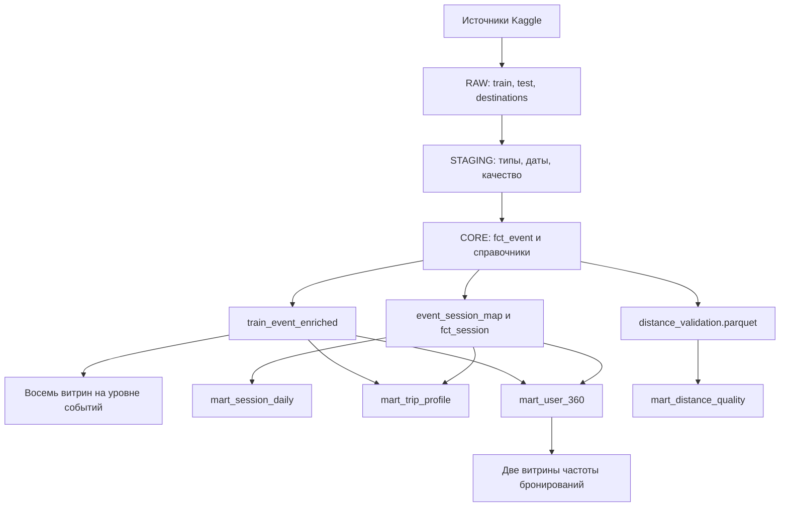

# Структура аналитических витрин

Документ описывает 14 аналитических витрин, расположенных в `data/marts/`, их
гранулярность, источники, основные показатели и назначение.

## Общая архитектура данных

Данные проходят четыре последовательных слоя:

1. `RAW` — исходные таблицы `train`, `test` и `destinations` без изменений;
2. `STAGING` — приведение типов, разбор дат, поиск дубликатов и формирование
   признаков качества;
3. `CORE` — нормализованные таблицы фактов и справочники;
4. `MARTS` — агрегированные витрины для продуктового анализа и отчётности.

Скрипт `scripts/build_analytics.py` читает только слой `CORE`. В процессе
сборки он создаёт временное представление `train_event_enriched`, объединяя
`core.fct_event` со справочниками даты, местоположения пользователя, рынка
гостиниц и параметров поиска. Это представление не является отдельным
хранимым слоем.

## Карта зависимостей

К восьми витринам на уровне событий относятся `mart_product_daily`,
`mart_travel_calendar_daily`, `mart_channel_platform`,
`mart_destination_performance`, `mart_origin_destination`,
`mart_package_profile`, `mart_retention_cohort` и
`mart_data_quality_daily`.

### Точные зависимости витрин

| Витрина | Непосредственные источники |
|---|---|
| `mart_product_daily` | `core.fct_event`, `core.dim_date` через `train_event_enriched` |
| `mart_session_daily` | `core.fct_session` |
| `mart_travel_calendar_daily` | `core.fct_event`, `core.dim_date` |
| `mart_channel_platform` | `core.fct_event`, `core.dim_date` через `train_event_enriched` |
| `mart_destination_performance` | `core.fct_event`, `core.dim_date` через `train_event_enriched` |
| `mart_user_360` | `core.fct_event`, `core.dim_date`, `core.fct_session` |
| `mart_origin_destination` | `core.fct_event`, `core.dim_date`, `core.dim_user_location`, `core.dim_hotel_market` |
| `mart_trip_profile` | `core.fct_event`, `core.dim_date`, `core.dim_search_params`, `core.event_session_map`, `core.fct_session` |
| `mart_package_profile` | `core.fct_event`, `core.dim_date`, `core.dim_search_params` |
| `mart_retention_cohort` | события бронирований из `core.fct_event` |
| `mart_booking_frequency` | `mart_user_360` |
| `mart_booking_frequency_exact` | `mart_user_360` |
| `mart_data_quality_daily` | `core.fct_event` |
| `mart_distance_quality` | `data/derived/core/distance_validation.parquet` |

`core.event_session_map` связывает события с восстановленными сессиями, а
`core.fct_session` содержит агрегированные характеристики этих сессий. Сессия
начинается, если между соседними событиями одного пользователя прошло более
30 минут.

## Общие правила расчёта показателей

| Поле | Определение |
|---|---|
| `row_events` / `events` | Количество агрегированных строк исходного журнала |
| `weighted_events` | Сумма `cnt`, то есть количество событий с учётом кратности исходных строк |
| `bookings` | Количество строк с `is_booking = 1` |
| `bookers` | Количество уникальных пользователей хотя бы с одним бронированием |
| `booking_row_rate` | Отношение `bookings / row_events` |
| `booking_weighted_event_rate` | Доля бронирований среди событий с учётом `cnt` |
| `booking_value_proxy_total` | Сумма условной ценности бронирований; это не денежная сумма и не выручка |
| `active_users` / `users` | Количество уникальных пользователей внутри одной строки витрины |

Доли хранятся в диапазоне от `0` до `1`. Форматирование в проценты выполняется
в аналитической системе. Большинство месячных полей представлены датой первого
дня месяца.

## Сводный каталог

| № | Витрина | Гранулярность | Строк |
|---:|---|---|---:|
| 1 | `mart_product_daily` | `date_key` | 724 |
| 2 | `mart_session_daily` | `date_key` начала сессии | 724 |
| 3 | `mart_travel_calendar_daily` | `date_key` календаря | 6 908 |
| 4 | `mart_channel_platform` | `year_month, channel, platform_id, is_mobile` | 11 720 |
| 5 | `mart_destination_performance` | `year_month, destination_id, hotel_market_id` | 502 728 |
| 6 | `mart_user_360` | `user_id` | 1 198 786 |
| 7 | `mart_origin_destination` | `year_month, user_country, hotel_country` | 151 998 |
| 8 | `mart_trip_profile` | месяц × срок до поездки × длительность × состав группы | 2 399 |
| 9 | `mart_package_profile` | профиль поездки × пакет × канал × устройство | 72 280 |
| 10 | `mart_retention_cohort` | `cohort_month, months_since_first_booking` | 300 |
| 11 | `mart_booking_frequency` | укрупнённая группа числа бронирований | 5 |
| 12 | `mart_booking_frequency_exact` | точное число бронирований | 101 |
| 13 | `mart_data_quality_daily` | `date_key` | 724 |
| 14 | `mart_distance_quality` | `imputation_level, min_support` | 49 |

## 1. `mart_product_daily`

Основная дневная продуктовая витрина.

- Ключ: `date_key`.
- Объём: `active_users`, `row_events`, `weighted_events`.
- Бронирования: `bookings`, `bookers`, `booking_row_rate`,
  `booking_weighted_event_rate`, `booker_rate`.
- Условная ценность: `booking_value_proxy_total`,
  `booking_value_proxy_per_active_user`,
  `avg_booking_value_proxy_per_booking`.
- Структура событий и бронирований: `mobile_row_share`,
  `mobile_booking_share`, `package_booking_share`.
- Параметры поездки и качество: `avg_valid_lead_days`,
  `avg_valid_stay_nights`, `avg_distance_filled`,
  `distance_imputed_share`.

Назначение: основные показатели продукта и их динамика по дням.

## 2. `mart_session_daily`

Дневные показатели восстановленных сессий.

- Ключ: `date_key` начала сессии.
- Объём: `active_users`, `sessions`, `booking_sessions`.
- Эффективность: `session_booking_rate`, `sessions_per_user`,
  `booking_value_proxy_per_session`.
- Поведение: `avg_rows_per_session`, `avg_weighted_events_per_session`,
  `median_session_duration_seconds`, `avg_time_to_first_booking_seconds`,
  `multi_destination_session_share`.
- Дополнительный показатель: `booking_value_proxy_total`.

Назначение: анализ числа сессий, доли сессий с бронированием и поведения
пользователей внутри сессии.

## 3. `mart_travel_calendar_daily`

Календарная витрина объединяет три роли даты: дату события, дату заезда и дату
выезда.

- Календарные ключи: `date_key`, `full_date`, `year`, `month`, `year_month`.
- Активность: `events_on_date`, `weighted_events_on_date`,
  `bookings_made_on_date`.
- Поездки: `checkins_on_date`, `checkouts_on_date`, `package_checkins`,
  `booking_value_proxy_for_checkins`.
- Параметры поездок: `avg_stay_nights_for_checkins`,
  `avg_lead_days_for_checkins`.

Между датами сохраняются строки с нулевыми значениями, поэтому витрина
подходит для непрерывного календарного ряда. Физический диапазон итогового CSV
— с 15 февраля 2012 года по 13 января 2031 года. Основная активность
обучающей выборки сосредоточена в 2013–2015 годах, поэтому при анализе
необходимо ограничивать период.

## 4. `mart_channel_platform`

Сравнение каналов и платформ во времени.

- Гранулярность: `year_month, channel, platform_id, is_mobile`.
- Объём: `active_users`, `row_events`, `weighted_events`, `bookings`.
- Эффективность: `booking_row_rate`, `booking_weighted_event_rate`,
  `booking_value_proxy_per_active_user`.
- Структура бронирований: `package_booking_share`.
- Параметры поездки: `avg_valid_lead_days`, `avg_valid_stay_nights`.
- Условная ценность: `booking_value_proxy_total`.

`active_users` нельзя суммировать между каналами без повторной дедупликации
пользователей.

## 5. `mart_destination_performance`

Показатели обезличенных направлений и гостиничных рынков.

- Гранулярность: `year_month, destination_id, hotel_market_id`.
- Объём: `active_users`, `row_events`, `weighted_events`, `bookings`,
  `bookers`.
- Конверсии: `booking_row_rate`, `booking_weighted_event_rate`.
- Структура и параметры поездки: `package_booking_share`,
  `avg_distance_filled`, `avg_valid_lead_days`, `avg_valid_stay_nights`.
- Условная ценность: `booking_value_proxy_total`.
- Признаки достаточного объёма: `meets_min_volume_flag` для
  `row_events >= 100` и `meets_booking_min_volume_flag` для `bookings >= 10`.

Перед сравнением конверсии небольших направлений необходимо применять признаки
достаточного объёма.

## 6. `mart_user_360`

Одна строка на пользователя за весь наблюдаемый период.

- Ключ: `user_id`.
- Жизненный цикл: `first_seen_date`, `last_seen_date`, `active_days`,
  `active_months`, `observation_end_date`.
- Активность: `row_events`, `weighted_events`, `sessions`,
  `session_frequency`.
- Бронирования: `bookings`, `first_booking_date`, `last_booking_date`,
  `booking_sessions`, `days_since_last_booking`, `booking_frequency`.
- Условная ценность, пакеты и устройства: `booking_value_proxy_total`,
  `avg_booking_value_proxy`, `package_bookings`, `package_booking_share`,
  `mobile_event_share`.
- Разнообразие и параметры поездок: `distinct_destinations`,
  `distinct_hotel_markets`, `avg_valid_lead_days`, `avg_valid_stay_nights`,
  `avg_distance_filled`.

Назначение: пользовательские сегменты, частота и повторяемость бронирований.

## 7. `mart_origin_destination`

Потоки между страной пользователя и страной гостиницы.

- Гранулярность: `year_month, user_country, hotel_country`.
- Объём: `active_users`, `row_events`, `weighted_events`, `bookings`.
- Эффективность: `booking_row_rate`, `booking_value_proxy_total`.
- Параметры поездки: `avg_distance_filled`, `package_booking_share`,
  `avg_valid_stay_nights`, `avg_valid_lead_days`.

## 8. `mart_trip_profile`

Поведение пользователей в зависимости от параметров будущей поездки.

- Гранулярность: `year_month, lead_time_bucket, stay_length_bucket,
  party_segment`.
- Объём: `users`, `events`, `weighted_events`, `bookings`, `sessions`,
  `booking_sessions`.
- Эффективность: `booking_row_rate`, `booking_weighted_event_rate`,
  `session_booking_rate`.
- Структура: `package_share`, `mobile_share`.
- Условная ценность: `booking_value_proxy_total`.

Группы срока до поездки:

- `same_next_day` — заезд в тот же или следующий день;
- `2_7` — через 2–7 дней;
- `8_30` — через 8–30 дней;
- `31_90` — через 31–90 дней;
- `91_plus` — через 91 день и более.

Группы длительности проживания: `1`, `2_3`, `4_7`, `8_14`, `15_plus`.

Сегменты путешественников:

- `solo` — один человек;
- `couple` — двое взрослых без детей;
- `family_with_children` — группа с детьми;
- `group` — остальные группы.

## 9. `mart_package_profile`

Детализация профиля поездки по пакетному сценарию, каналу и устройству.

- Гранулярность: `year_month, is_package, lead_time_bucket,
  stay_length_bucket, party_segment, channel, is_mobile`.
- Объём: `users`, `events`, `weighted_events`, `bookings`,
  `weighted_bookings`.
- Эффективность: `booking_row_rate`, `booking_weighted_event_rate`.
- Условная ценность: `booking_value_proxy_total`.

Назначение: сравнение пакетных и обычных поездок, а также поиск сегментов с
низкой конверсией.

## 10. `mart_retention_cohort`

Когортная витрина повторных бронирований.

- Ключ: `cohort_month, months_since_first_booking`.
- Размер когорты: `cohort_users`.
- Возврат: `returned_bookers`, `booking_retention_rate`.
- Активность: `bookings`, `booking_value_proxy_total`.

Нулевой месяц равен 100% по определению. Последующие значения показывают долю
пользователей когорты, совершивших бронирование именно в соответствующем месяце
после первого бронирования. Показатель не является накопительным удержанием.

## 11. `mart_booking_frequency`

Укрупнённое распределение пользователей по числу бронирований.

- Ключ: `booking_count_bucket` со значениями `0`, `1`, `2`, `3`, `4_plus`.
- Порядок сортировки: `booking_count_bucket_order`.
- Размер сегмента: `users`, `user_share`.
- Профиль: `avg_sessions`, `avg_active_months`,
  `avg_booking_value_proxy`, `avg_package_booking_share`.

## 12. `mart_booking_frequency_exact`

Точное распределение пользователей по числу бронирований.

- Ключ: `bookings`.
- Показатели: `users`, `user_share`.

В отличие от укрупнённой витрины, значения от 4 до 100 не объединяются в одну
группу.

## 13. `mart_data_quality_daily`

Дневной мониторинг качества данных.

- Ключ: `date_key`.
- Объём: `rows`, `weighted_events`.
- Расстояние: `missing_distance_share`, `imputed_distance_share`.
- Даты и параметры поездки: `invalid_lead_time_share`, `invalid_stay_share`,
  `zero_party_share`.
- Общий показатель: `quality_issue_share`.

## 14. `mart_distance_quality`

Результаты проверки стратегии заполнения `orig_destination_distance` на
отложенной выборке.

- Ключ: `imputation_level, min_support`.
- Покрытие: `holdout_rows`, `covered_rows`, `coverage_pct`,
  `average_support`.
- Ошибки: `mae`, `median_absolute_error`, `p90_absolute_error`.

Назначение: выбор допустимого уровня и минимального числа наблюдений для
заполнения расстояний. Эта витрина не является продуктовым показателем.

## Важные ограничения

- Витрины `mart_product_daily`, `mart_channel_platform`,
  `mart_destination_performance`, `mart_origin_destination`,
  `mart_trip_profile` и `mart_package_profile` используют только строки
  обучающей выборки с корректной датой события.
- `mart_trip_profile` и `mart_package_profile` исключают строки с некорректным
  сроком до поездки, длительностью проживания или составом путешественников.
- `mart_retention_cohort` описывает повторные бронирования внутри наблюдаемого
  периода, а не удержание пользователя за всю жизнь.
- Пользователи могут одновременно встречаться в нескольких строках витрин,
  поэтому показатели уникальных пользователей нельзя бездумно суммировать по
  сегментам.

